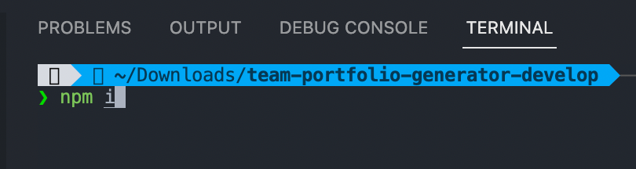
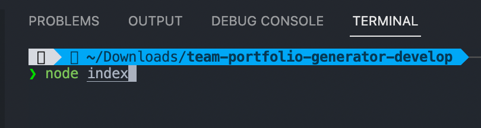
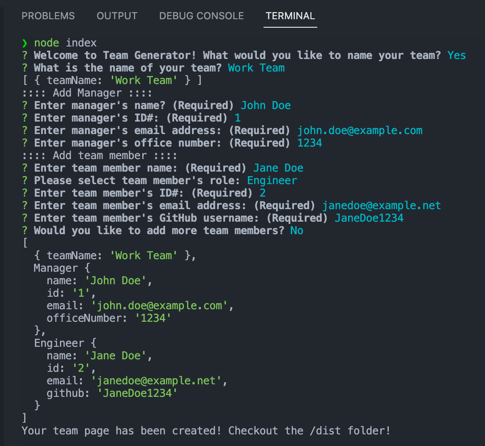
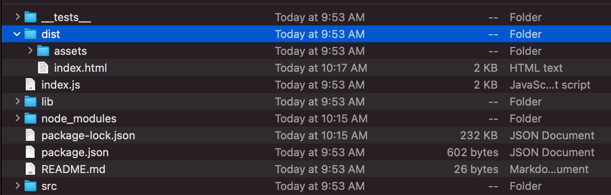
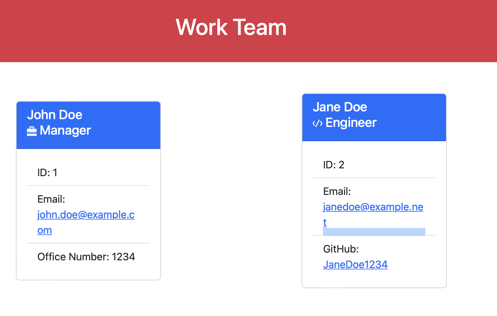

# Team Portfolio Generator

## Description

Node application that allows users to build a development team's portfolio. Simply answer the prompts in the CLI to generate a HTML file with entered information!

## Table of Contents

- [Installation](#installation)
- [Usage](#usage)

## Installation

1. Make sure Node is installed
2. Clone/download zip of repository
3. Run `npm install` or `npm i` in terminal  
   

## Usage

1. Run `node index` in command line  
   
2. Answer prompts  
   
3. Navigate to the /dist folder  
   
4. Open index.html to see new page!  
   
5. Remember to copy entire dist folder contents (css and images)

## License

## Questions

If you have any questions, you can reach me at:

- [GitHub: J0J0C0DING](https://github.com/J0J0C0DING)
- [joeyrebne.bootcamp@gmail.com](mailto:joeyrebne.bootcamp@gmail.com)
